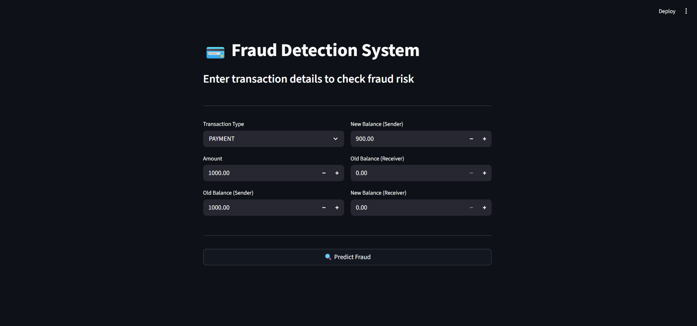
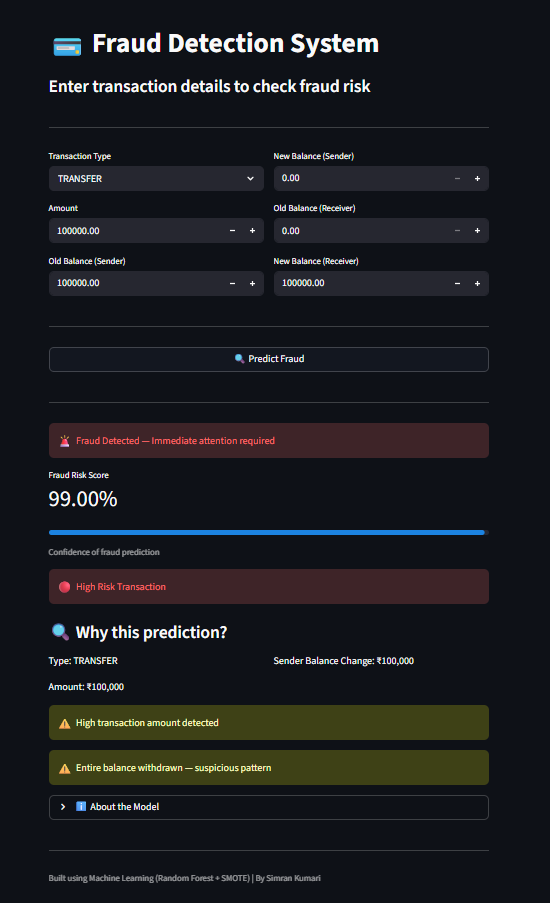
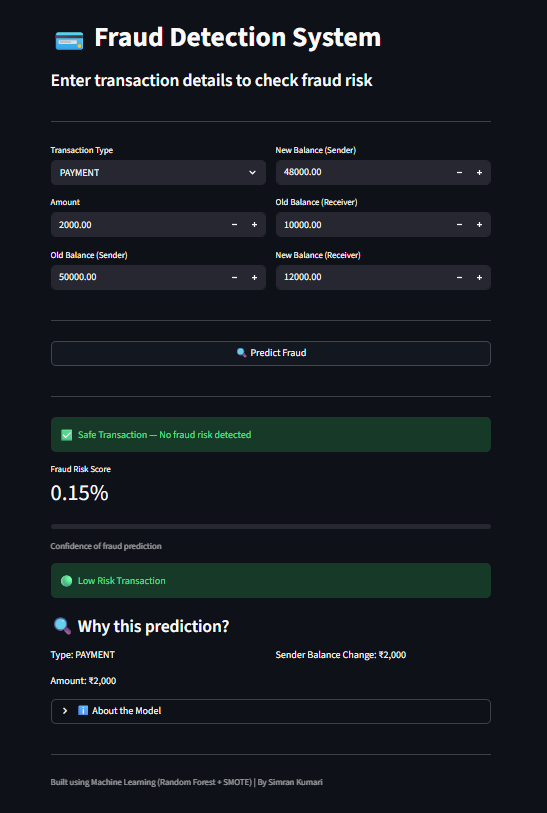
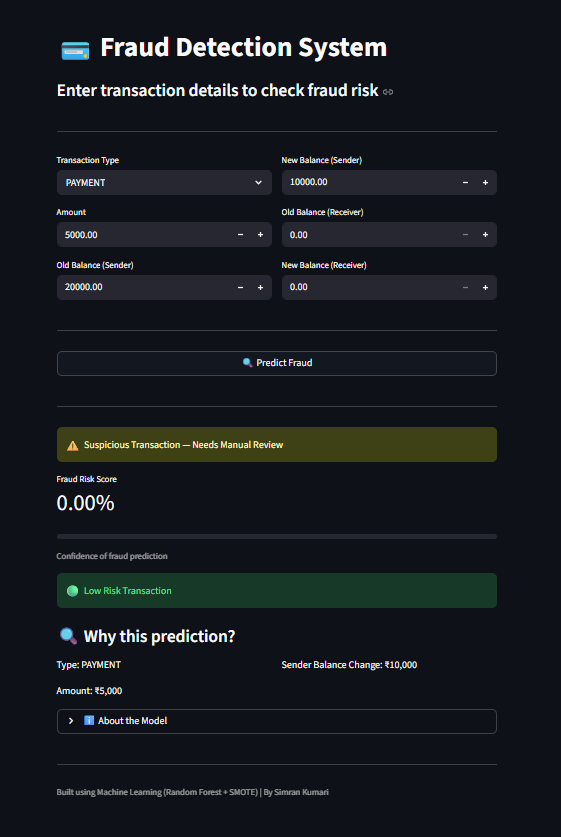

# 💳 Hybrid Fraud Detection System

A machine learning-based fraud detection system that identifies suspicious financial transactions using a combination of **ML models and rule-based logic**.

---

## 🚀 Overview

This project focuses on detecting fraudulent transactions in highly imbalanced financial datasets.
It combines:

* **Machine Learning (Random Forest)**
* **SMOTE (handling class imbalance)**
* **Feature Engineering (balance inconsistency detection)**
* **Hybrid Logic (ML + rule-based validation)**

---

## 🎯 Key Features

* 🔍 Real-time fraud prediction using Streamlit
* ⚖️ Handles imbalanced data using SMOTE
* 🧠 Feature engineering (balance_error, balance_ratio, withdrawal patterns)
* 🔗 Hybrid system combining ML predictions with rule-based checks
* 📊 Model comparison (Logistic Regression, Random Forest, XGBoost)
* 📈 Risk scoring with confidence visualization

---

## 📸 Screenshots

### 🔹 Application Interface


### 🔹 Fraud Detection (High Risk)


### 🔹 Safe Transaction


### 🔹 Suspicious Transaction


---


## 🛠️ Tech Stack

* Python
* Pandas, NumPy
* Scikit-learn
* XGBoost
* Imbalanced-learn (SMOTE)
* Streamlit

---

## 📂 Project Structure

```
fraud-detection/
│
├── app/
│   └── fraud_detection.py       # Streamlit UI
│
├── src/
│   └── train_models.py          # Model training script
│
├── data/
│   └── AIML Dataset.csv        # (Not included - see below)
│
├── models/
│   └── fraud_detection_pipeline.pkl   # Generated after training
│
├── results/
│   └── model_comparison.csv
│
├── notebooks/
│   └── analysis_model.ipynb
│
└── README.md
```

---

## 📊 Dataset

This project uses a **synthetic financial transaction dataset generated using PaySim**.

⚠️ Dataset is not included in this repository due to size limitations.

👉 Download dataset from Kaggle:
https://www.kaggle.com/datasets/amanalisiddiqui/fraud-detection-dataset?resource=download

After downloading, place the file in:

```
data/AIML Dataset.csv
```

---


## ⚙️ Setup Instructions

### 1️⃣ Clone the repository

```
git clone https://github.com/Simran-Kumari92/fraud-detection-system
cd hybrid-fraud-detection-system
```

---

### 2️⃣ Install dependencies

```
pip install -r requirements.txt
```

---

### 3️⃣ Train the model

```
cd src
python train_models.py
```

👉 This will generate:

```
models/fraud_detection_pipeline.pkl
```

---

### 4️⃣ Run the application

```
cd ..
streamlit run app/fraud_detection.py
```

---

## 🧠 How It Works

### 🔹 Machine Learning Model

* Random Forest classifier trained on transaction data
* Handles imbalance using SMOTE

---

### 🔹 Feature Engineering

* Detects inconsistencies in transaction balances
* Adds domain-specific insights to model

---

### 🔹 Hybrid Logic (Key Highlight)

* ML predicts probability
* Rule-based logic detects:

  * Full balance withdrawal
  * High transaction amounts
  * Balance inconsistencies

👉 Final decision combines both approaches

---

## 📈 Model Performance

| Model               | Precision | Recall | F1 Score |
| ------------------- | --------- | ------ | -------- |
| Logistic Regression | Low       | High   | Low      |
| Random Forest       | Medium    | High   | Best     |
| XGBoost             | Medium    | High   | Good     |

---

## ⚠️ Limitations

* Dataset is highly imbalanced
* Some transaction types (e.g., PAYMENT) have very few fraud cases
* Model relies on dataset patterns

---

## 🚀 Future Improvements

* Use larger and more diverse datasets
* Add deep learning models
* Improve fraud detection for rare transaction types
* Deploy on cloud (AWS / Streamlit Cloud)

---


